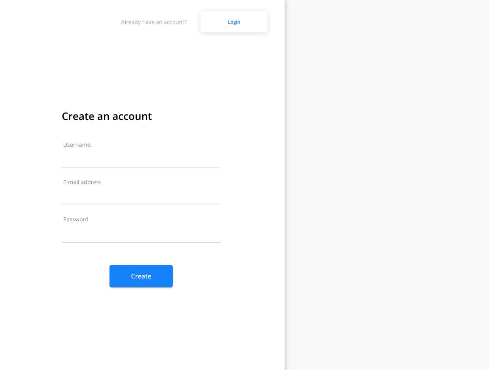

## LovingSitter

A Marketplace for Dog Sitters + Dog Owners

**Tech Stack:** MongoDB, Express.js, React.js, Node.js, Typescript

**Contributors**: [Mohamed El Serafy](https://github.com/serafy0), [Leo Blanco](https://github.com/lipob), [Abdulrasaq Durosomo](https://github.com/darothub), [Konrad](https://github.com/konradkop), and [ethan](https://github.com/moffatethan)

---

### Getting Started

1. Clone or download repository

---

## Server

1. Go into the server directory `cd server`
2. Run `npm install` to install packages
3. Create your environment variable (.env) file
4. Run `npm run dev` to start the server
5. Run `npm run test` to start test

---

## Client

1. Go into the client directory `cd client`
2. Run `npm install` to install packages
3. Run `npm start` to start the client side

---

### Demo

1. Registration. Users will be able to create a new account using their email and password

2. Dashboard. Here is a description about what a user can expect to see

